<h1 align="center">Clevertec java course</h1>
<h2 align="center">Lesson 2 - Gradle</h2>

<h3>Task</h3>
<li>Установить Gradle</li>
<li>Проект должен быть совместим с java 17</li>
<li>Создать файл.jar, например, «util-1.3.5.jar»</li>
<li>Манифест файл должен содержать имя и версию вашего .jar файла</li>
<li>В вашем .jar файле должен быть class StringUtils с методом boolean isPositiveNumber(String str)</li>
<li>Написать один unit test для проверки этого метода (использовать JUnit 5).</li>
<li>Заполнить и отправить форму</li>

<h3>Дополнительно:</h3>
<li>Сделать gradle плагин, который также опубликовать и подключить к проекту, например плагин по формированию отчёта</li>
<li>Создать мульти-модульный проект с двумя модулями: core, api</li>
<li>В модуле core должен быть class Utils с методом boolean isAllPositiveNumbers(String… str)</li>
<li>Использовать util-1.3.5.jar сделанный на предыдущих этапах, для возможности переиспользовать метод boolean isPositiveNumber(String str) в модуле core</li>
<li>В модуле api должен быть class App с методом main.</li>
<li>Из модуля api в методе main вызвать Utils.isAllPositiveNumbers("12", "79")</li>
<li>аписать один unit test для проверки этого метода boolean isAllPositiveNumbers(String… str)(использовать JUnit 5).</li>

<h3> Выполнение основной задачи</h3>

*В проекте использован gradle-8.2, wrapper исключен из .gitignore

Был создан проект следующей структуры

В виде следующего дерева директорий

Применены следующие настройки для jar

Формирующие следующий манифест согласно задания

Все методы описаны JavaDoc

<h3> Выполнение дополнительных задач (api/core)</h3>

Созданы структуры core

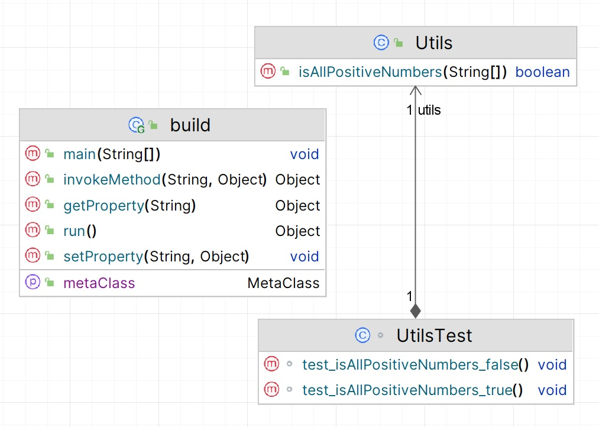

и api

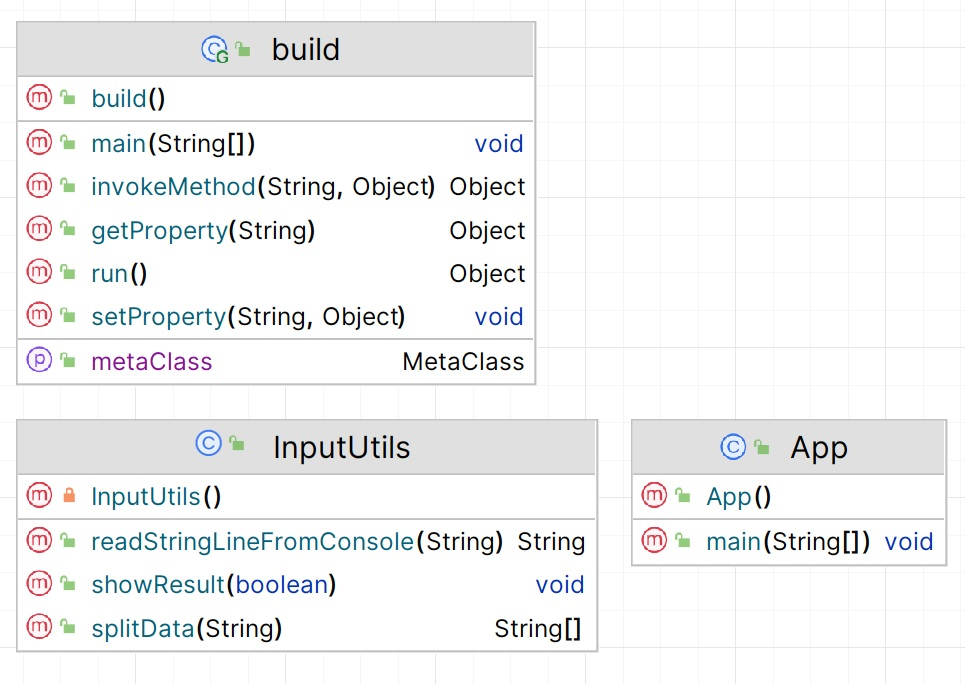

В виде следующих деревьев директорий

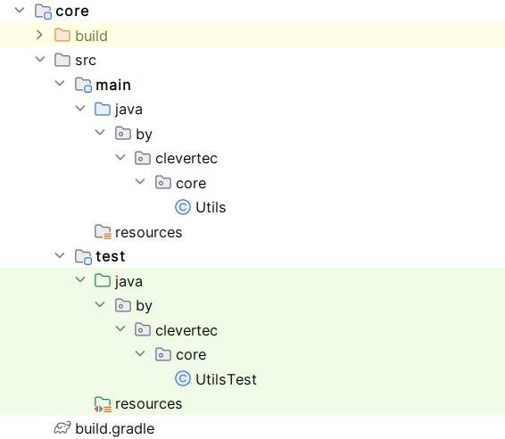

 

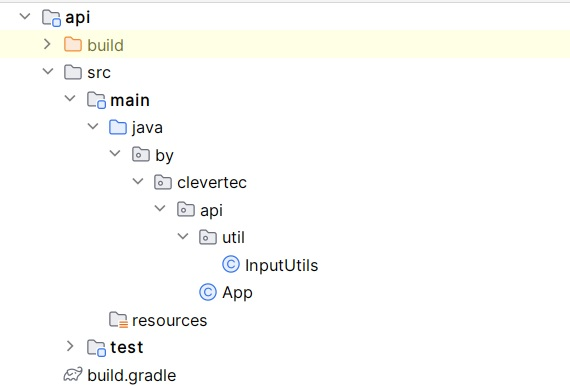

Применены следующие настройки для jar в core

Настройки .build для api

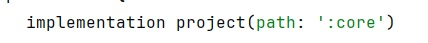

Тем самым обеспечены следующие зависимости

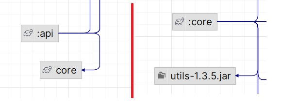

<h4>Исправления по итогам уточнений</h4>

Перестроил проект, вынеся базовую задачу в отдельный модуль

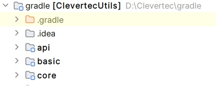

Сменил имплементацию на базовый метод, для исключения необходимости билда при проверке проекта

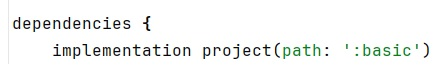

Добавил таску для плагина jacoco

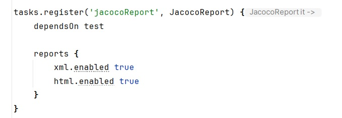

Настроил верификацию плагина jacoco

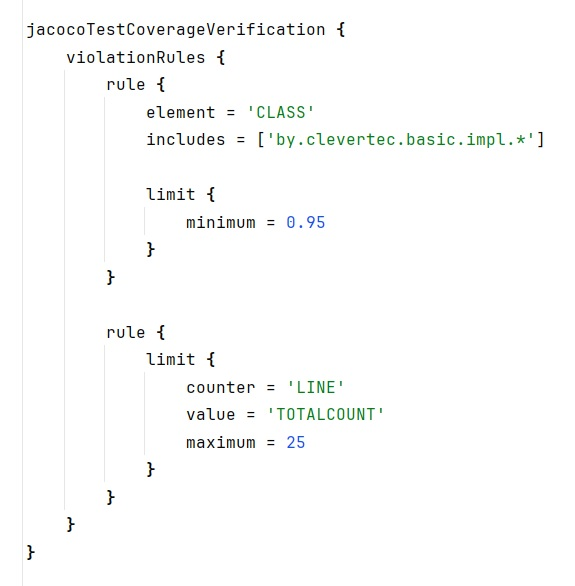

Получил отчет с охватом модуля basic тестами

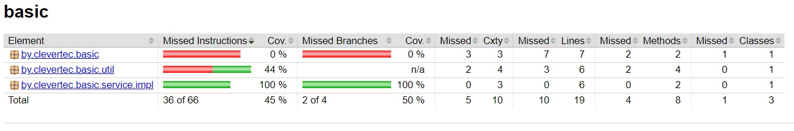

<h4>Создание и добавление плагина</h4>

Так как плагин с отчетами хорош сам по себе и уже добавлен, то создал плагин на генерацию случайного числа

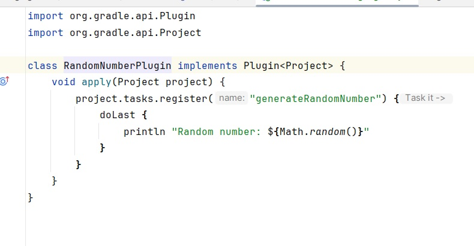

Расположил его в модуле buildSrc для автоматической компиляции и добавлении в classpath проекта

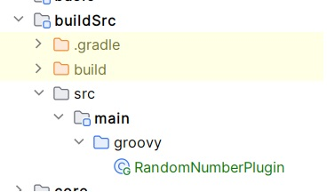

Используя apply plugin: RandomNumberPlugin в build.gradle basic-модуля, получил в other таску

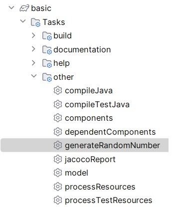

И выполнил вручную, для проверки наделанного

<h3>Спасибо за внимание, хорошего дня!</h3>
